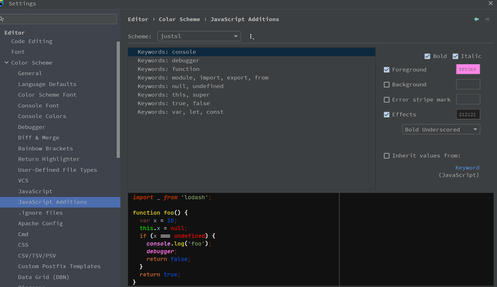

# JavaScript Color Additions

<!-- Plugin description -->
Plugin allows to manage colors and styles of couple JS keywords.

```
Open Settings
-> Editor Tab 
-> Color Scheme 
-> Javascript Additions
```

```
Then you can set custom styles to a keywords in a list.
Enjoy.
```
<!-- Plugin description end -->